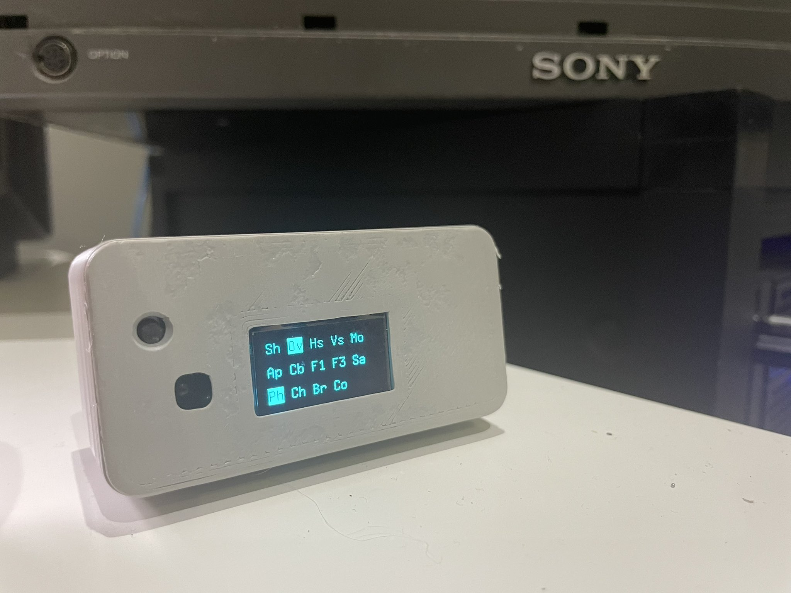

# BKM-10Replacements
BKM-10Replacements are cheap microcontroller based alternative for the Sony BKM-10R control unit typically used with Sony broadcast monitors like the BVM-D20F1a/e/u.

The most up-to-date version is BKM10-Rp2040, based on the Raspberry Pico. See the docs in that directory for setup instructions.

## Why?
BVM and PVM CRTs are rather popular with retro gaming enthusiasts, but they are being priced out of reach for the average fan. I managed to rescue a BVM-D20F1A that was destined for e-waste. Of course it was missing the control unit and it was stuck on the SDI input. One spare Arduino Nano, a couple of components, and a lot of swearing later, I had something good enough to use the menus to change inputs and do basic setup. With the help of Martin (@skumlos), this evolved in to a universal IR based replacement.

## What's it do?
Allows the use of almost any IR remote you might have lying around to control any BVM compatible with the BKM-10R. It's configurable through a learning mode, so it's kind of like using a universal remote control, if you remember those from the late 90s. All the buttons on the BKM-10R are replicated, and all status LEDs are displayed on an OLED screen.

There's no problem assembling this on a breadboard, but there are KiCAD schematics, PCB designs and gerber files included if you'd like a more polished finised product.

## Warning
I'm not an electrical engineer. I don't know enough to know when I'm doing something stupid or dangerous. Goes without saying that there is absolutely no warranty; if your precious monitor explodes, I will be very sympathetic and sorry, but that's all. Proceed at your own risk.

If you want to build the PCB version, there are some SMT components, so a least a bit of soldering experience is highly recommended.
## Thanks
I found the control codes on an anonymous [pastebin](https://pastebin.com/aTUWf33J), so must thank this unknown hero.
